# Hunter x Hunter Codex Pets

Fan-made animated desktop pets for Codex inspired by characters from *Hunter x Hunter*.

This repository contains multiple fan-made pets and is structured so more characters and visual variants can be added under `pets/` later.

## Available Pets

| Pet | Character | Preview |
| --- | --- | --- |
| `cool-killua` | Killua Zoldyck / 奇犽·揍敌客 | [Contact sheet](previews/cool-killua-contact-sheet.png) |
| `cute-killua` | Cute Killua / 萌版奇犽 | [Contact sheet](previews/cute-killua-contact-sheet.png) |
| `cute-gon` | Cute Gon / 萌版小杰 | [Contact sheet](previews/cute-gon-contact-sheet.png) |
| `uvogin` | Uvogin / 窝金 | [Contact sheet](previews/uvogin-contact-sheet.png) |

## Preview

### `cool-killua` / 酷奇犽

<p align="center">
  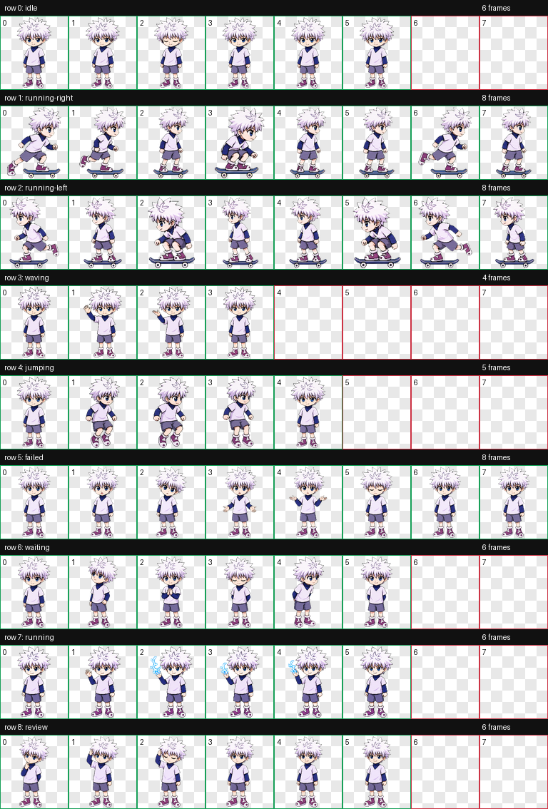
</p>

<p align="center">
  
  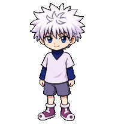
  
  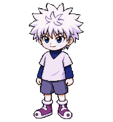
</p>

<p align="center"><sub>Idle / Waving / Jumping / Task work</sub></p>

### `cute-killua` / 萌版奇犽

<p align="center">
  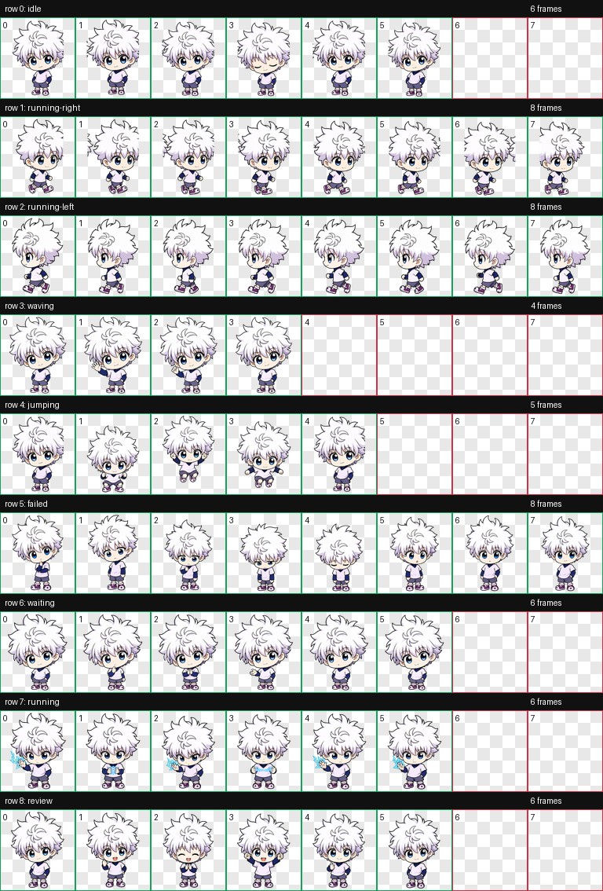
</p>

<p align="center">
  
  
  
  
</p>

### `cute-gon` / 萌版小杰

<p align="center">
  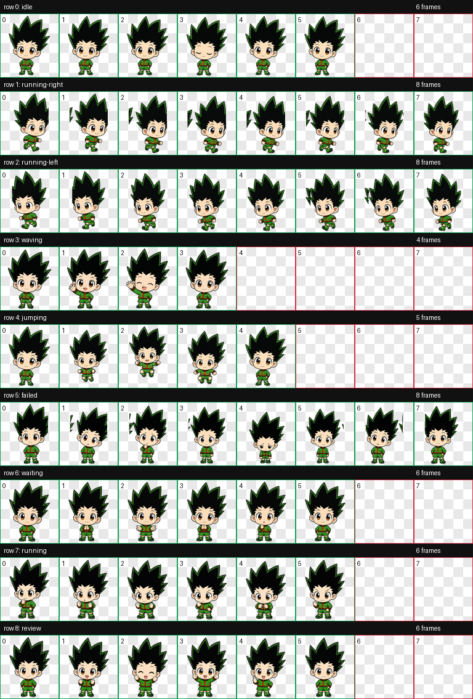
</p>

<p align="center">
  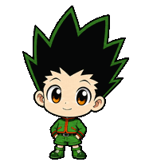
  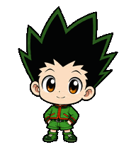
  
  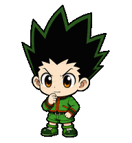
</p>

### `uvogin` / 窝金

<p align="center">
  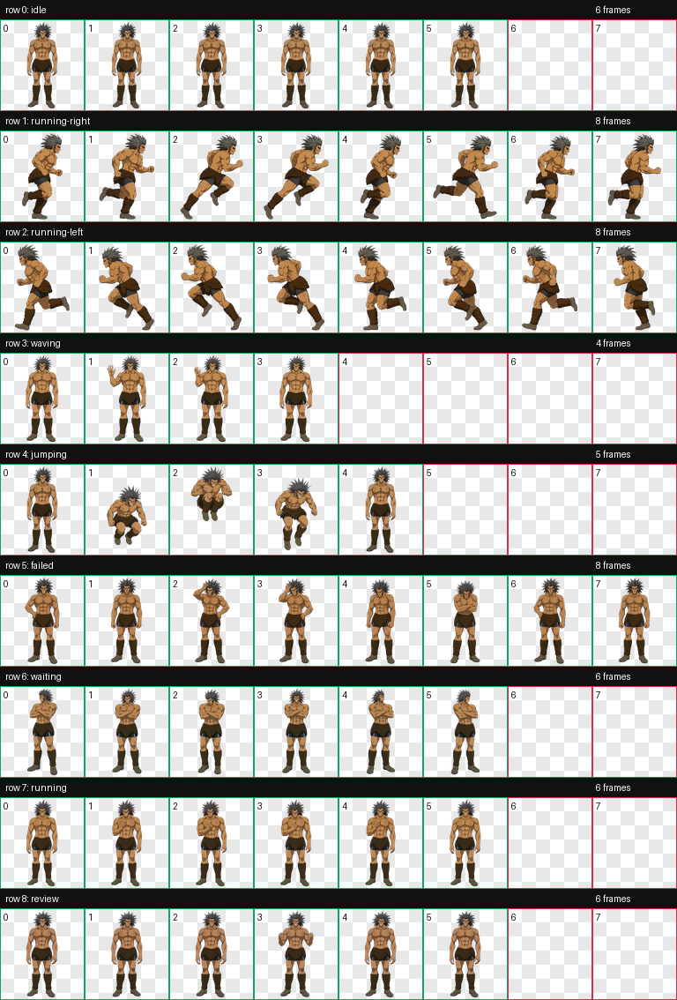
</p>

<p align="center">
  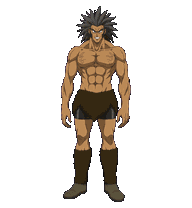
  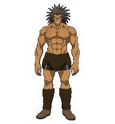
  
  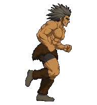
</p>

## Install

Copy one desired pet directory into your Codex custom pets folder:

```text
%USERPROFILE%\.codex\pets\<pet-id>\
  pet.json
  spritesheet.webp
```

Available pet IDs: `cool-killua`, `cute-killua`, `cute-gon`, and `uvogin`.

In Codex, open **Settings > Personalization > Pets**, refresh custom pets, select the new pet, and wake it if it is hidden.

## Codex Pet Format

Each pet package contains:

```text
pets/<pet-id>/
  pet.json
  spritesheet.webp
```

The spritesheet uses the Codex custom pet atlas format:

- `1536 x 1872` WebP with transparency
- `8 x 9` cells
- `192 x 208` pixels per cell
- nine animation rows: idle, moving right, moving left, waving, jumping, failed, waiting, running/task work, and review

`jumping` begins and ends in an idle-like standing pose because Codex may enter this animation when the pointer hovers over a pet.

## Project Status

- `cool-killua`: available
- `cute-killua`: available
- `cute-gon`: available
- `uvogin`: available
- Additional *Hunter x Hunter* pets: planned

## Disclaimer

This is an unofficial, fan-made project and is not affiliated with or endorsed by Yoshihiro Togashi, Shueisha, Nippon Animation, Madhouse, or any other rights holder associated with *Hunter x Hunter*.

*Hunter x Hunter* and its characters remain the property of their respective rights holders. This repository does not grant rights to the underlying characters or franchise. No open-source license is asserted over character-derived visual assets.

---

# 全职猎人 Codex 桌面宠物

这是一个非官方粉丝项目，用于收集可在 Codex 中使用的《全职猎人》动画桌面宠物。当前包含酷奇犽、萌版奇犽、萌版小杰和窝金，后续可继续在 `pets/` 下扩展更多角色及造型版本。

安装时将所需的 `pets/<pet-id>` 文件夹复制到 `%USERPROFILE%\.codex\pets\`，然后在 Codex 的 **设置 > 个性化 > 宠物** 中刷新并选择该宠物。

角色与作品相关权利归原权利方所有。本项目不代表官方授权，也不对角色衍生美术素材授予开源许可。
